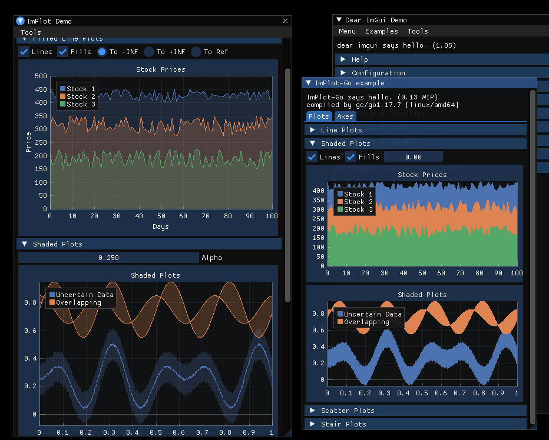

For information on the original imgui-go [go here](https://github.com/inkyblackness/imgui-go)
 
## ImPlot for Go
This library is a [Go](https://www.golang.org) wrapper for [ImPlot](https://github.com/epezent/implot/), merged into a fork of [imgui-go](https://github.com/inkyblackness/imgui-go) which wraps [Dear ImGui](https://github.com/ocornut/imgui).

It currently targets `ImPlot v0.13` with `imgui-go v4.5.0` (which wraps `Dear ImGui v1.85`).

It has similar goals compared to inkyblackness's imgui-go wrapper:
 - [x] hand-crafted
 - [x] documented
 - [ ] feature-complete
 - [ ] versioned
 - [x] with examples (living in another repo [here](https://github.com/Edgaru089/implot-go-example))

---

ImPlot-go is merged with a fork of ImGui-go because of the way Go links C/C++ libraries. Basically, Go/GC links
every package into a standalone .so library, before linking them staticly to somehow get the final executable.
The symbols are somehow again deduplicated (?), and with system libraries this is perfectly fine.

But, because of that, for ImPlot to reach into ImGui, they must be built together.

---

**I just `rm -rf`ed what I've been working on for a whole day. Don't ever do that.** - 2022/02/19

This is very much work in progress, here is a list from the Table of Contents of implot.h:
 - [x] Contexts
 - [x] Begin/End Plot
 - [x] Begin/End Subplot
 - [x] Setup
 - [ ] SetNext
 - [ ] Plot Items
 - [ ] Plot Tools
 - [ ] Plot Utils
 - [ ] Legend Utils
 - [ ] Drag and Drop
 - [x] Styling (& SetNextXXXStyle)
 - [ ] Colormaps
 - [ ] Input Mapping
 - [ ] Miscellaneous
